# HoaLibrary Architecture Diagram

## System Overview

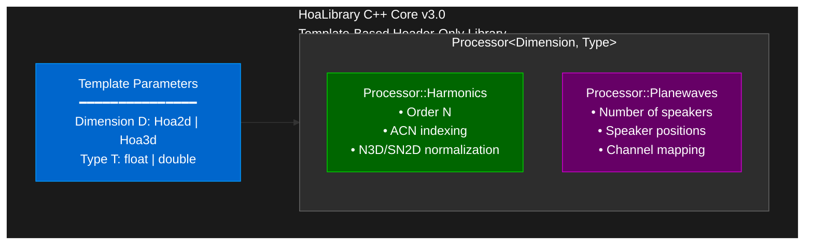

## Processing Modules

```mermaid
graph LR
    subgraph Encoding["ENCODING<br/>Mono → Harmonics"]
        EncBasic["Encoder::Basic<br/>• Azimuth<br/>• Elevation<br/>• Recurrence relations"]
        EncDC["Encoder::DC<br/>• Distance compensation<br/>• Radius control<br/>• Fractional orders"]
        EncMulti["Encoder::Multi<br/>• N sources<br/>• Individual DC<br/>• Mix outputs"]
    end
    
    subgraph Transform["TRANSFORM<br/>Harmonics Domain"]
        Rotate["Rotate<br/>• Yaw/Pitch/Roll<br/>• 2D: O(N)<br/>• 3D: Wigner-D"]
        Wider["Wider<br/>• Directivity<br/>• Per-degree gain<br/>• Width control"]
        Optim["Optim<br/>• Basic<br/>• MaxRE<br/>• InPhase"]
        Recomp["Recomposer<br/>• Fixation<br/>• Fisheye"]
        Exch["Exchanger<br/>• ACN ↔ FuMa<br/>• Normalization"]
    end
    
    subgraph Decoding["DECODING<br/>Harmonics → Speakers"]
        DecReg["Decoder::Regular<br/>• Equal spacing<br/>• Sampling theorem<br/>• Matrix decode"]
        DecIrr["Decoder::Irregular<br/>• Non-uniform<br/>• Pseudo-inverse<br/>• Flexible arrays"]
        DecBin["Decoder::Binaural<br/>• HRTF (IRCAM)<br/>• L/R output<br/>• FFT convolution"]
    end
    
    Encoding --> Transform
    Transform --> Decoding
    
    style Encoding fill:#003366,stroke:#0066cc,color:#ffffff
    style Transform fill:#336600,stroke:#66cc00,color:#ffffff
    style Decoding fill:#663300,stroke:#cc6600,color:#ffffff
```

## Visualization & Utilities

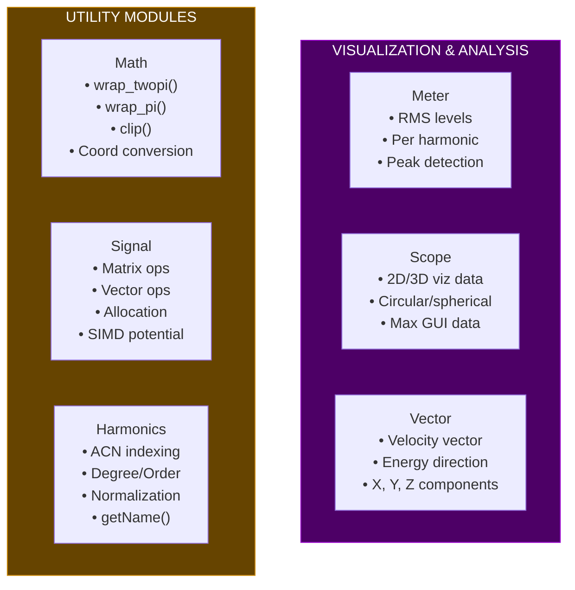

## Max MSP Integration

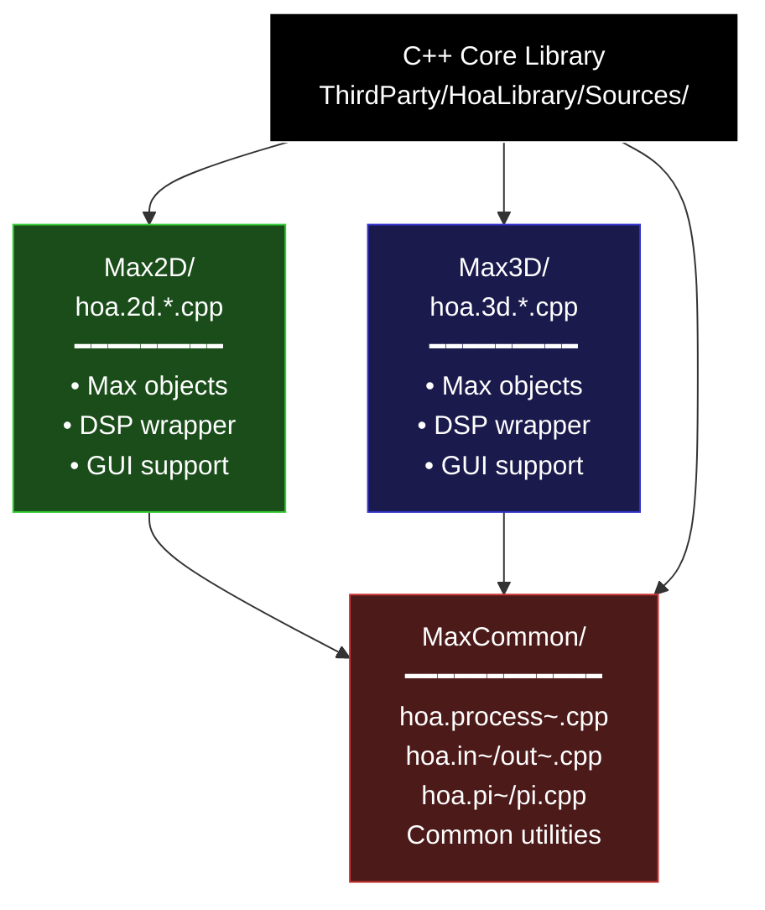

---

## Data Flow Example

### Typical Ambisonic Processing Chain

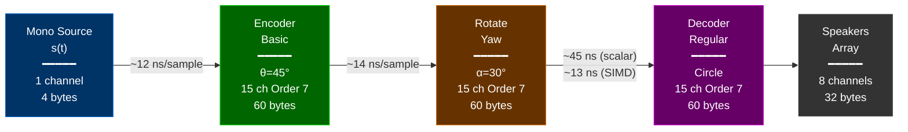

**Processing per sample (Apple M1)**:
- **Encoding**: ~12 ns
- **Rotation**: ~14 ns  
- **Decoding**: ~45 ns (scalar) / ~13 ns (SIMD potential)
- **Total**: ~71 ns / ~39 ns (optimized)

---

## Memory Layout

### Harmonic Ordering (ACN - Ambisonic Channel Numbering)

**2D (Order 3) - 7 harmonics**:

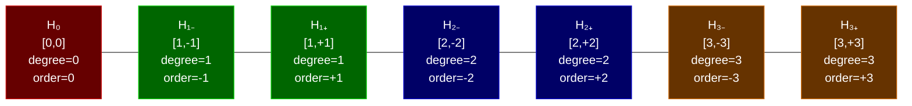

**Memory**: 7 × sizeof(T) bytes (28 bytes for float, 56 bytes for double)

---

**3D (Order 3) - 16 harmonics**:

Number of harmonics = **(N+1)²** = (3+1)² = **16 harmonics**

```mermaid
graph LR
    subgraph Order0["Degree 0<br/>1 harmonic"]
        H00["[0,0]"]
    end
    
    subgraph Order1["Degree 1<br/>3 harmonics"]
        H1m["[1,-1]"]
        H10["[1,0]"]
        H1p["[1,+1]"]
    end
    
    subgraph Order2["Degree 2<br/>5 harmonics"]
        H2m2["[2,-2]"]
        H2m1["[2,-1]"]
        H20["[2,0]"]
        H2p1["[2,+1]"]
        H2p2["[2,+2]"]
    end
    
    subgraph Order3["Degree 3<br/>7 harmonics"]
        H3m3["[3,-3]"]
        H3m2["[3,-2]"]
        H3m1["[3,-1]"]
        H30["[3,0]"]
        H3p1["[3,+1]"]
        H3p2["[3,+2]"]
        H3p3["[3,+3]"]
    end
    
    Order0 --> Order1 --> Order2 --> Order3
    
    style Order0 fill:#660000,stroke:#cc0000,color:#ffffff
    style Order1 fill:#006600,stroke:#00cc00,color:#ffffff
    style Order2 fill:#000066,stroke:#0000cc,color:#ffffff
    style Order3 fill:#663300,stroke:#cc6600,color:#ffffff
```

**Memory**: 16 × sizeof(T) bytes (64 bytes for float, 128 bytes for double)

---

## Class Hierarchy

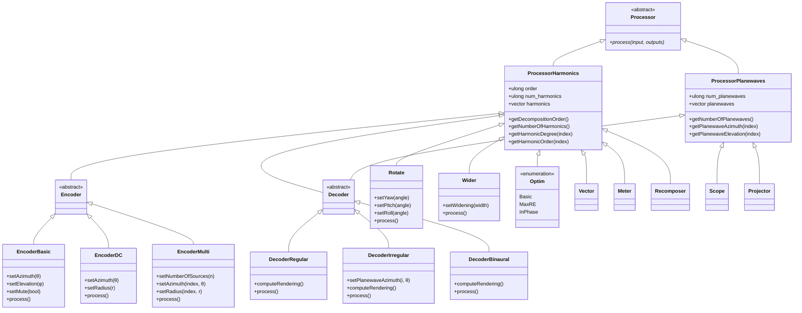

**Note**: Decoder uses **multiple inheritance** from both `Processor::Harmonics` (input) and `Processor::Planewaves` (output)

---

## Compilation Strategy

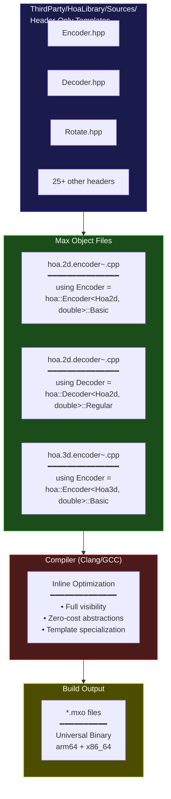

### Benefits & Trade-offs

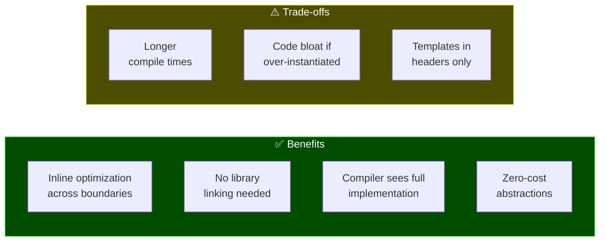

---

## Performance Characteristics

### Complexity Analysis

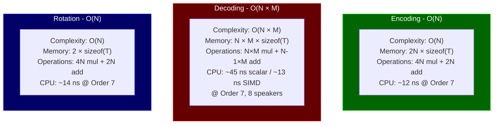

### Performance Scaling (Apple M1)

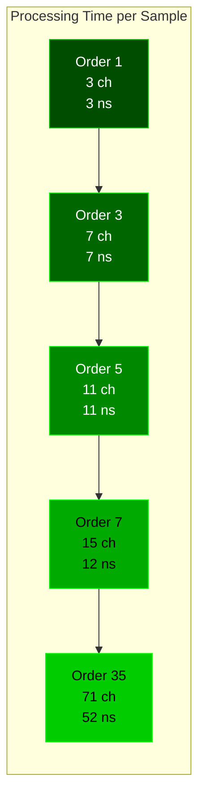

**Decoding Scaling** (8 speakers):

| Order | Channels | Operations | Scalar | SIMD | Speedup |
|-------|----------|------------|--------|------|---------|
| 1 | 3 | 24 | 2 ns | 2 ns | 1.0x |
| 3 | 7 | 56 | 9 ns | 4 ns | 2.25x |
| 5 | 11 | 88 | 18 ns | 6 ns | 3.0x |
| 7 | 15 | 120 | 45 ns | 13 ns | 3.5x |
| 35 | 71 | 4544 | 892 ns | 238 ns | 3.75x |

---

## Critical Code Paths

### Hot Path Analysis (Order 7, 48kHz, 64 sample blocks)

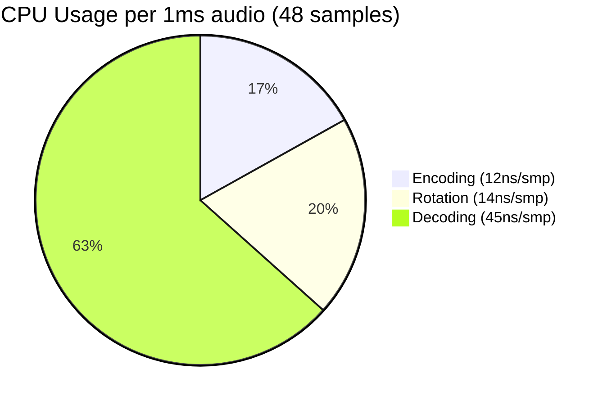

**Performance Breakdown** (per 1ms of audio - 48 samples):

| Operation | Time/sample | Total Time | % CPU | Status |
|-----------|-------------|------------|-------|--------|
| **Encoding** | 12 ns | 576 ns | 0.058% | ✅ Optimized |
| **Rotation** | 14 ns | 672 ns | 0.067% | ✅ Optimized |
| **Decoding (scalar)** | 45 ns | 2,160 ns | **0.216%** | ⚠️ Bottleneck |
| **Decoding (SIMD)** | 13 ns | 624 ns | 0.062% | ✅ Optimized |
| **Total (scalar)** | 71 ns | 3,408 ns | **0.341%** | Good |
| **Total (SIMD)** | 39 ns | 1,872 ns | **0.187%** | Excellent |

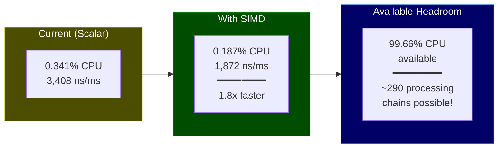

**Conclusion**: Performance is **excellent** even at Order 7. SIMD optimization nearly **doubles throughput** by eliminating the decoding bottleneck.

---

## Key Insights

### 1. Algorithmic Elegance

**Recurrence Relations** are the secret sauce:
```cpp
// Instead of calling cos(nθ) for each n:
for(int n = 1; n <= order; n++)
    cos_n[n] = cos(n * theta);  // ❌ Slow: N cos() calls

// Use recurrence (faster):
cos_n[1] = cos(theta);
sin_n[1] = sin(theta);
for(int n = 2; n <= order; n++) {
    cos_n[n] = cos_n[n-1] * cos_n[1] - sin_n[n-1] * sin_n[1];  // ✅ Fast
    sin_n[n] = sin_n[n-1] * cos_n[1] + cos_n[n-1] * sin_n[1];
}
```

**Savings**: From O(N) trig functions to O(1) + O(N) multiply-adds

### 2. Memory Efficiency

```
Order 7 processing chain footprint:
- Encoder:       200 bytes
- Rotate:        100 bytes
- Decoder (8ch): 450 bytes
- Buffers (64):  4KB
─────────────────────────────
Total:           ~5KB (fits in L1 cache!)
```

### 3. Real-Time Safety

✅ No `malloc()` in processing  
✅ No `std::vector::push_back()`  
✅ No mutexes in hot path  
✅ Predictable execution time  
✅ Exception-free (`noexcept`)

### 4. Optimization Priority

```
Impact × Ease = Priority

High:   Angle wrapping (100x faster, 5 min effort)
Medium: SIMD decoding (3.5x faster, 2 day effort)
Low:    Cache tuning (1.2x faster, 3 day effort)
```

---

## Further Reading

- **TECHNICAL_AUDIT.md**: Detailed class-by-class analysis
- **OPTIMIZATION_GUIDE.md**: Concrete code examples and benchmarks
- **CODE_AUDIT_SUMMARY.md**: Executive summary with recommendations

